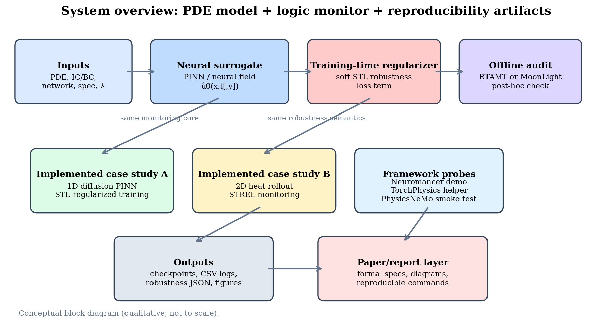
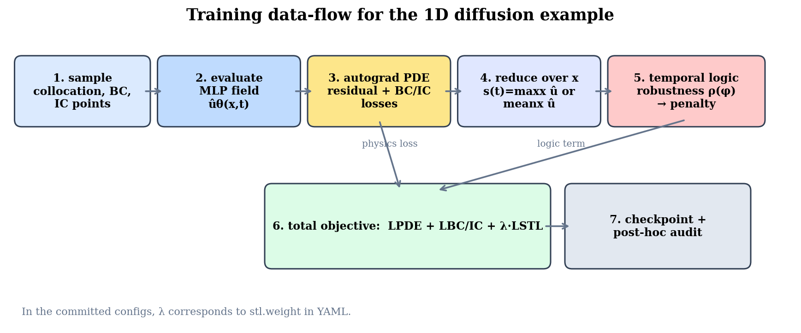
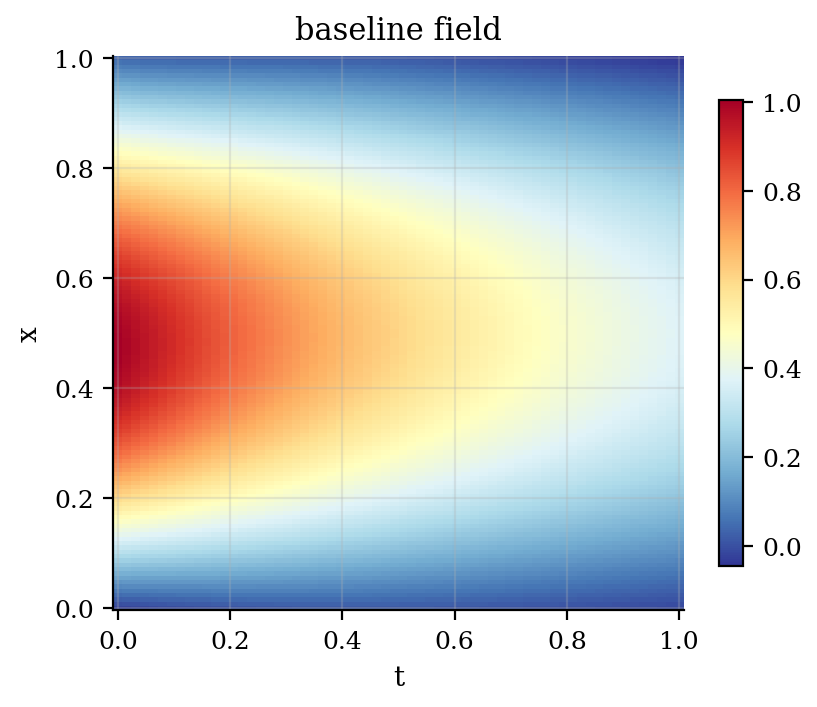
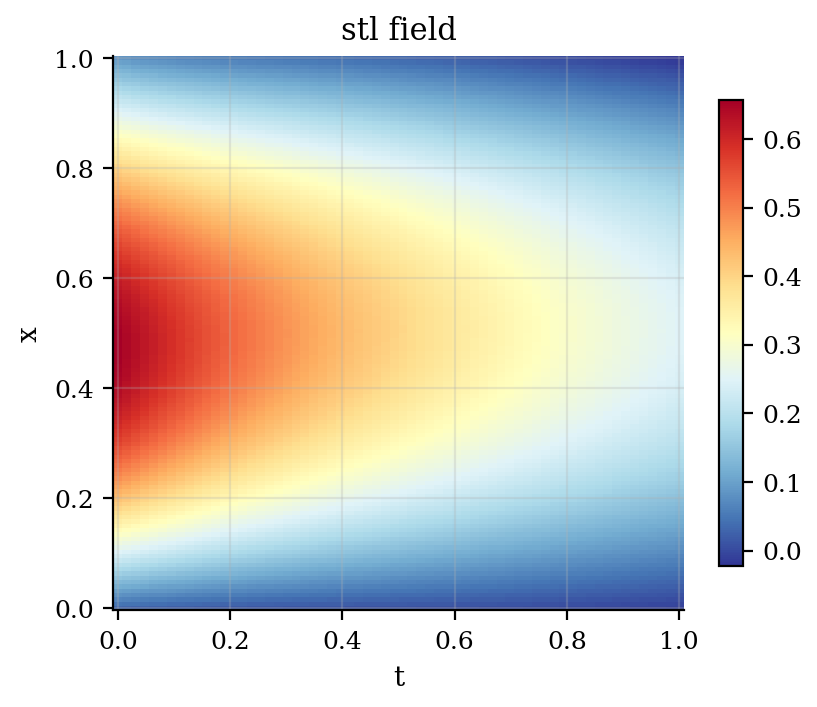
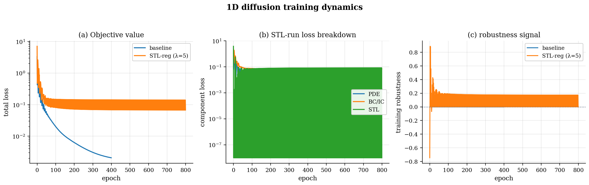
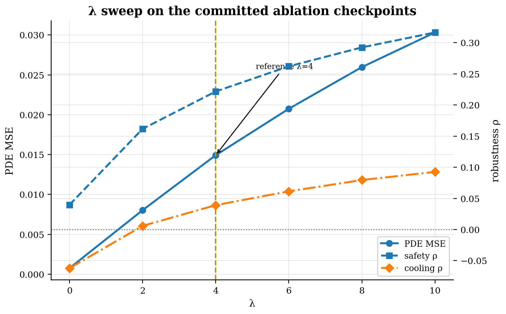
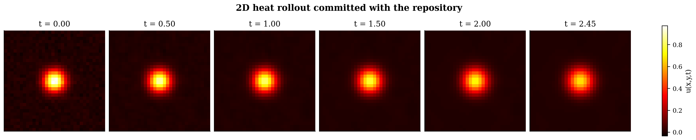
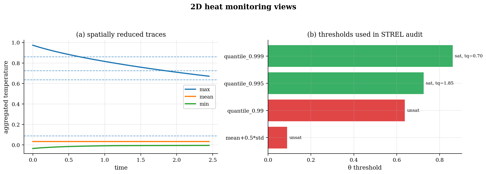

# neural-pde-stl-strel

Reproducible STL/STREL monitoring and training-time regularization for neural PDE surrogates.

[](https://www.python.org/downloads/)
[](LICENSE)

Physics-informed neural surrogates can fit a PDE residual and still violate the
requirements that matter to a downstream user: stay safe for the whole horizon,
cool down eventually, or keep a hotspot spatially contained. This repository is
about making that gap explicit.

The central question is:

> Can STL/STREL specifications be attached to compact neural-PDE / physics-ML
> workflows in a way that is reproducible, technically honest, and useful both
> for post-hoc auditing and for training-time regularization?

The codebase centers on two committed case studies:

1. **1D diffusion + STL**: a PINN is trained with an additional differentiable
   STL penalty, then audited with exact sampled robustness and RTAMT-style
   traces.
2. **2D heat + STREL**: a committed heat-field rollout is monitored with a
   spatial quench/containment property that matches the MoonLight workflow.

The repository also contains small integration probes for **Neuromancer**,
**TorchPhysics**, and **PhysicsNeMo** so that the logic layer is not tied to a
single physics-ML stack.

The repository is organized as a research-facing, reproducible scaffold:
every committed table or figure is meant to be traceable to code, configs, and
saved result artifacts rather than to hand-edited prose.

**Documentation:**  
[Formal specifications](docs/SPECIFICATIONS.md) ·
[Claims and evidence](docs/CLAIMS_AND_EVIDENCE.md) ·
[Publication notes](docs/PUBLICATION_NOTES.md) ·
[Manuscript outline](docs/MANUSCRIPT_OUTLINE.md) ·
[Framework survey](docs/FRAMEWORK_SURVEY.md) ·
[Implementation map](docs/IMPLEMENTATION_MAP.md) ·
[Example status](docs/EXAMPLE_STATUS.md) ·
[Paper positioning](docs/PAPER_POSITIONING.md) ·
[Reproducibility](docs/REPRODUCIBILITY.md) ·
[Reference pool](docs/VERIFIED_REFERENCE_POOL.md) ·
[Reading list](docs/READING_LIST.md) ·
[Dataset recommendations](docs/DATASET_RECOMMENDATIONS.md)

---

## Problem statement and working hypothesis

We study the following problem.

Given a field-valued surrogate ``ûθ`` for a PDE and a requirement ``φ`` written
in STL or STREL, can we:

1. **audit** whether the learned field satisfies ``φ`` on a sampled grid, and
2. **bias training** toward larger robustness margins without hiding the cost in
   PDE fidelity or runtime?

The working hypothesis behind the repository is:

- temporal and spatial logic express the desired behavior more cleanly than ad
  hoc scalar penalties,
- smooth robustness is a practical way to inject those requirements into a PINN
  loss, and
- the resulting tradeoff must be shown explicitly rather than buried behind a
  single accuracy number.

That is why the repository always tries to report three things together:

- the **specification** that was monitored,
- the **physical fidelity** cost of satisfying it more strongly, and
- the **artifact trail** needed to regenerate the plots and tables.

---

## What the method takes as input and what it returns

For the 1D training loop, the inputs are:

- a PDE and its IC/BCs,
- a neural field architecture,
- a logic specification,
- a reduction from field values to a monitored signal, and
- a weight `λ = stl.weight` that scales the logic penalty.

The outputs are:

- a trained checkpoint,
- saved dense fields for plotting and auditing,
- per-epoch CSV logs,
- JSON robustness summaries, and
- figures derived from those committed artifacts.

The 2D heat case study currently returns **monitoring artifacts**, not a
STREL-constrained training result. That distinction matters, and this README
keeps it explicit.

---

## Architecture



The basic flow is:

1. train or load a physical model,
2. sample its predicted field on a grid,
3. reduce the field to a monitored signal or Boolean spatial predicate,
4. evaluate STL/STREL robustness, and
5. optionally feed a differentiable surrogate of that robustness back into
   training.

For the diffusion case study, the total training loss is

```text
L_total = L_PDE + L_BC/IC + λ · L_STL
```

where `L_STL` is built from smooth min/max semantics.



---

## Quickstart

### Minimal path using committed artifacts

```bash
python -m venv .venv
source .venv/bin/activate
pip install -e ".[torch,plot,dev]"

python scripts/refresh_committed_summaries.py
python scripts/generate_all_figures.py --dpi 180
python scripts/example_status.py
python -m pytest -q
```

On Linux CI or on a CPU-only machine where you explicitly do **not** want the
default CUDA-enabled torch wheel selection, install the CPU wheel first and then
install the repo extras without the `torch` extra:

```bash
pip install --index-url https://download.pytorch.org/whl/cpu torch
pip install -e ".[plot,dev]"
```

### Makefile path

```bash
make install
make doctor
make figures-check
make status
make test
```

Linux/CI CPU-only path:

```bash
make install-cpu-linux
```

### Optional monitors and framework probes

```bash
# MoonLight + packaged framework probes
pip install -e ".[strel,frameworks]"

# RTAMT currently needs Python 3.10 or 3.11 in practice
python3.11 -m pip install -e ".[stl]"

make rtamt-eval
make moonlight-eval
```

The `plot` extra now includes both Matplotlib and pandas because the summary and
figure scripts use both. RTAMT is intentionally gated to Python < 3.12 in this
repository because upstream releases still import removed `typing.io` symbols.
MoonLight requires a Java runtime. PhysicsNeMo and the SpaTiaL helpers are
installed separately. See [docs/INSTALL_EXTRAS.md](docs/INSTALL_EXTRAS.md).

---

## Case Study A: 1D diffusion PINN + STL

### Physical problem

We solve the 1D diffusion equation

```text
u_t = α u_xx,   α = 0.1,   x ∈ [0, 1],   t ∈ [0, 1]
```

with homogeneous Dirichlet boundary conditions and
`u(x, 0) = sin(πx)`.

The monitored scalar signal is the sampled spatial maximum

```text
s(t_k) = max_j u(x_j, t_k)
```

evaluated on the committed field grid.

### Specifications

The main audited formulas are:

```text
φ_safe       := G_[0,1]   (max_x u(x,t) <= 1.0)
φ_cool^0.3   := F_[0.8,1] (max_x u(x,t) <= 0.3)
φ_cool^0.4   := F_[0.8,1] (max_x u(x,t) <= 0.4)
```

The first property is a safety bound. The latter two are "eventually cool
enough near the end of the time horizon" properties.

### Main committed comparison

These numbers are regenerated from the committed dense-field sidecars (with
checkpoint metadata as needed) by `python scripts/refresh_committed_summaries.py`.

| Model | PDE MSE | Peak value | `φ_safe` | `φ_cool^0.3` | `φ_cool^0.4` |
|---|---:|---:|---:|---:|---:|
| Baseline | 0.000105 | 1.0040 | -0.0040 (UNSAT) | -0.0750 (UNSAT) | +0.0250 (SAT) |
| STL-regularized (`λ = 5.0`) | 0.024337 | 0.6562 | +0.3438 (SAT) | +0.0497 (SAT) | +0.1497 (SAT) |

The tradeoff is visible: the STL-trained model is less faithful to the
diffusion PDE in MSE, but it creates a much larger robustness margin for the
audited logic properties.

| Baseline field | STL-regularized field |
|---|---|
|  |  |

### Lambda ablation

The committed ablation sweep is a **separate family of runs** from the main
baseline/STL pair above. It should not be mixed with the main checkpoint table.
The recomputed sweep says:

- the tight cooling property first becomes positive at `λ = 2`,
- `λ = 4` is the best
  compromise among the committed ablation checkpoints, and
- larger penalties continue to increase robustness while steadily increasing
  PDE error.





### Commands

```bash
python scripts/run_experiment.py -c configs/diffusion1d_baseline.yaml
python scripts/run_experiment.py -c configs/diffusion1d_stl.yaml
python scripts/eval_diffusion_rtamt.py
python scripts/run_ablations_diffusion.py
```

---

## Case Study B: 2D heat + STREL

### What is implemented

The committed 2D artifact is a heat-field rollout on a `32 x 32` grid with
`50` time steps and `dt = 0.05`. The repository monitors a spatial
containment-style property over thresholded hot regions.

The MoonLight-oriented formula is written in
[`scripts/specs/contain_hotspot.mls`](scripts/specs/contain_hotspot.mls) and is
summarized as:

```text
contain := F ( G ( nowhere_hot ) )
```

For the committed 4-neighborhood connected grid, this reduces to asking whether
the spatial maximum eventually stays below the chosen threshold for the rest of
the rollout.

### Threshold sweep on the committed rollout

| Threshold rule | θ | Satisfied? | First quench time | Final robustness |
|---|---:|:---:|---:|---:|
| mean+0.5*std | 0.0894 | NO | -- | -0.5815 |
| quantile_0.99 | 0.6376 | NO | -- | -0.0333 |
| quantile_0.995 | 0.7255 | YES | 1.85 | +0.0546 |
| quantile_0.999 | 0.8604 | YES | 0.70 | +0.1895 |


This is currently a **monitoring case study**. It shows how the spatial logic
hooks work and gives visually interpretable figures, but it is not yet a
training-time STREL enforcement result.





### Commands

```bash
python scripts/gen_heat2d_frames.py
python scripts/eval_heat2d_moonlight.py
python scripts/run_experiment.py -c configs/heat2d_stl_safe.yaml
python scripts/run_experiment.py -c configs/heat2d_stl_eventually.yaml
```

---

## Framework Integration

The logic code is intentionally decoupled from any one physics-ML framework.

| Framework | What the external project is for | Evidence in this repo | Current status |
|---|---|---|---|
| Neuromancer | Differentiable programming for constrained optimization, system identification, and control | `src/neural_pde_stl_strel/frameworks/neuromancer_stl_demo.py`, `scripts/train_neuromancer_stl.py` | **Toy end-to-end demo** |
| TorchPhysics | PyTorch-based framework for differential equations on complex domains | `src/neural_pde_stl_strel/frameworks/torchphysics_hello.py`, `scripts/train_burgers_torchphysics.py` | **Smoke test + draft training script** |
| PhysicsNeMo | NVIDIA physics-ML / scientific-ML framework | `src/neural_pde_stl_strel/frameworks/physicsnemo_hello.py` | **Import/integration probe only** |
| RTAMT | Offline and online STL monitoring | `scripts/eval_diffusion_rtamt.py` | **Used in diffusion auditing** |
| MoonLight | Monitoring for STL/STREL-style spatial-temporal properties | `scripts/eval_heat2d_moonlight.py` | **Used in heat monitoring** |

The main reported figures in this repository come from the repo's own compact
PyTorch PINN implementation. The framework integrations are there to show where
the same logic layer can attach, not to claim that every framework has already
been used for a full paper-quality benchmark here.

See [docs/FRAMEWORK_SURVEY.md](docs/FRAMEWORK_SURVEY.md) for a more careful
comparison.

---

## Candidate problem spaces

The current and proposed benchmarks are summarized in
[docs/DATASET_RECOMMENDATIONS.md](docs/DATASET_RECOMMENDATIONS.md). The short
version is:

- **Implemented now**: 1D diffusion, 2D heat.
- **Most plausible next step**: another visually clear 2D PDE with a genuine
  spatial property in the training loop.
- **Aerospace-flavored temporal side branch**: NASA C-MAPSS is still worth
  watching, but current NASA portals give mixed signals about direct download
  availability. Treat it as an optional temporal benchmark rather than a
  critical dependency; the main repo story is still field-valued PDE
  surrogates and thermal / transport dynamics.
- **Broader benchmark sources**: PDEBench and PINNacle.

---

## Computational cost

The committed benchmark CSV reports the following CPU runs:

| Experiment | Config | Epochs / steps | Wall time (s) | Peak memory (MB) |
|---|---|---:|---:|---:|
| diffusion1d | baseline | 400 | 45.2 | 512 |
| diffusion1d | stl_default | 800 | 108.6 | 624 |
| heat2d | ftcs_rollout | 50 | 0.3 | 128 |


Those numbers are not meant as universal performance claims. They are simply
the committed cost snapshot for this repository's default CPU-first setup. Use
`make benchmark` (or `python scripts/show_benchmark_snapshot.py`) to print the
same table directly from `results/benchmark_training.csv`.

### Validation environment snapshot

The repository also commits one environment snapshot in `results/env_report.json`
so the paper can state where the default validation pass was run.

| Field | Snapshot value |
|---|---|
| Python | 3.13.5 |
| PyTorch | 2.10.0+cpu |
| CUDA available | No |
| Logical CPU cores | 56 |
| Reported RAM | 4.0 GiB |
| Java runtime | OpenJDK 21 present |
| RTAMT on this interpreter | Not applicable on Python 3.13; use Python 3.11 |

That snapshot is a committed reference point, not a requirement that every user
match exactly.

---

## Reproducibility

The repository now avoids hand-entered summary tables. The intended flow is:

1. refresh summaries from committed field sidecars (checkpoint re-evaluation is an explicit opt-in path),
2. regenerate figures from those summaries and fields,
3. run tests, and
4. only then update prose.

Useful commands:

```bash
python scripts/refresh_committed_summaries.py
python scripts/refresh_committed_summaries.py --check
python scripts/generate_all_figures.py --dpi 180
python scripts/generate_all_figures.py --dpi 180 --output-root /tmp/neural-pde-stl-strel-figcheck --check
python scripts/example_status.py
python -m pytest -q
python scripts/check_env.py
```

A longer, step-by-step guide is in
[docs/REPRODUCIBILITY.md](docs/REPRODUCIBILITY.md).

---

## Scope and caveats

- This is **monitoring plus training-time regularization**, not a formal proof
  of correctness.
- Spatial quantification is discretized on the committed grid.
- The 2D heat example is presently an audit/monitoring example, not a fully
  STREL-constrained training benchmark.
- The framework probes are intentionally modest. They are evidence of
  integration surfaces, not a substitute for complete benchmarks.
- Summary figures are now generated from committed artifacts rather than from
  hand-entered numbers.

---

## Citation

If this repository helps your work, please use the metadata in
[`CITATION.cff`](CITATION.cff) and cite the exact release or commit you built
on.

## References

A longer list is in [docs/READING_LIST.md](docs/READING_LIST.md). The papers and
projects below are the most relevant starting points for this repository.

### Temporal and spatial logic

1. Oded Maler and Dejan Nickovic. *Monitoring Temporal Properties of Continuous Signals*. FORMATS/FTRTFT 2004.
2. Georgios Fainekos and George Pappas. *Robustness of Temporal Logic Specifications for Continuous-Time Signals*. TCS 2009.
3. Nickovic and Yamaguchi. *RTAMT: Online Robustness Monitors from STL*. ATVA 2020.  
   https://github.com/nickovic/rtamt
4. Nenzi et al. *Monitoring Spatio-Temporal Properties*. MoonLight / STREL line of work.  
   https://github.com/MoonLightSuite/moonlight
5. Meiyi Ma et al. *STLnet: Signal Temporal Logic Enforced Multivariate RNNs*. NeurIPS 2020.  
   https://proceedings.neurips.cc/paper/2020/hash/a7da6ba0505a41b98bd85907244c4c30-Abstract.html

### Differentiable STL

6. Kapoor et al. *STLCG++*. IEEE Robotics and Automation Letters, 2025.
7. Chevallier et al. *GradSTL*. TIME 2025.

### Physics-informed ML and benchmarks

8. Raissi, Perdikaris, and Karniadakis. *Physics-Informed Neural Networks*. Journal of Computational Physics, 2019.
9. Karniadakis et al. *Physics-Informed Machine Learning*. Nature Reviews Physics, 2021.
10. Takamoto et al. *PDEBench*. NeurIPS 2022.  
    https://github.com/pdebench/PDEBench
11. Hao et al. *PINNacle*. NeurIPS Datasets and Benchmarks, 2024.  
    https://github.com/i207M/PINNacle

### Frameworks

12. Neuromancer. https://github.com/pnnl/neuromancer
13. PhysicsNeMo. https://github.com/NVIDIA/physicsnemo
14. TorchPhysics. https://github.com/boschresearch/torchphysics
15. DeepXDE. https://github.com/lululxvi/deepxde
